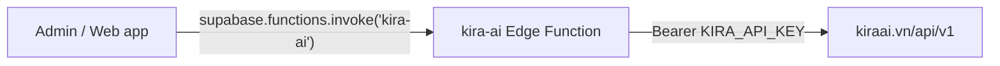

# Kira AI integration

CaviTour talks to [Kira AI](https://kiraai.vn) through the `kira-ai` Supabase Edge
Function. The browser never sees `KIRA_API_KEY` — it calls the function, the
function calls Kira.



## Setup

Deploy the function and set the secret once:

```bash
npx supabase secrets set KIRA_API_KEY=kira_xxxxxxxxxxxxxxxx
npx supabase functions deploy kira-ai
```

`KIRA_API_KEY` must never be a `VITE_*` or `EXPO_PUBLIC_*` variable — Vite and
Expo inline those into the shipped bundle.

## What the function exposes

| Action | Kira endpoint | Default model | Timeout |
| --- | --- | --- | --- |
| `chat` | `POST /api/v1/chat/completions` | `glm-5.3-flash-free` | 75s |
| `image` | `POST /api/v1/images/generations` | `kira-3.0-image` | 90s |
| `speech` | `POST /api/v1/audio/speech` | `kira-3.0-flash-tts` | 60s |

Callers must be signed in; requests carrying only the Supabase anon key get a
401, because every Kira call spends real credits. Kira's own 5xx responses are
retried twice with backoff, but timeouts are not — a slow model will not get
faster on the second try.

## Usage

Import from `lib/kiraAi` (`kiraAi.ts` in the admin app, `kiraAi.js` in the web
app — same API).

### Chat

```ts
import { kiraChatText } from '../lib/kiraAi';

const reply = await kiraChatText({
  temperature: 0.7,
  messages: [
    { role: 'system', content: 'You are a travel writer for Cavite, Philippines.' },
    { role: 'user', content: 'Write a one-line teaser for a Tagaytay ridge day trip.' },
  ],
});
```

`kiraChat` returns the full OpenAI-shaped response if you need `usage` or
`finish_reason`. Any extra field you pass — `max_tokens`, `top_p`, `tools` — is
forwarded to Kira untouched.

### Chat that returns JSON

`kiraChatJson` strips ``` fences and returns `null` instead of throwing when the
model answers with something unparseable, so a fallback path stays easy:

```ts
const parsed = await kiraChatJson<{ show: boolean }>({
  temperature: 0,
  messages: [
    { role: 'system', content: 'Reply with JSON only: {"show":true|false}.' },
    { role: 'user', content: reviewText },
  ],
});
if (parsed?.show == null) return heuristicFallback();
```

### Image generation

```tsx
const { dataUrl } = await kiraGenerateImage({
  prompt: 'Golden hour over the Taal volcano ridge in Tagaytay, wide landscape photo',
  aspectRatio: '16:9',
});

return ;
```

The function returns the base64 payload as `b64Json`, plus `dataUrl` for direct
use in an ``. To store it in Supabase Storage, decode `b64Json` first.

### Text to speech

```tsx
const { dataUrl } = await kiraTextToSpeech({
  input: 'Welcome to Cavite. Your itinerary starts in Tagaytay.',
  voice: 'alloy',
});

return <audio controls src={dataUrl} />;
```

Audio comes back base64-encoded rather than as raw bytes, because `supabase-js`
only parses JSON, blobs and text from an Edge Function response.

## Where it is used today

- `apps/admin/src/lib/adminItineraryGenerator.ts` writes itinerary titles,
  subtitles and stop highlights. If Kira fails, `generateAiTextOrFallback` falls
  back to deterministic copy, so generation never hard-fails.
- `apps/admin/src/lib/reviewSentiment.ts` moderates destination reviews, falling
  back to regex heuristics.

Both previously called `api.openai.com` straight from the browser with
`VITE_OPENAI_API_KEY`. That variable is gone; delete it from `apps/admin/.env`
and rotate the key if it was ever deployed.

## Troubleshooting

- **"Kira AI is unavailable. Deploy the kira-ai Edge Function…"** — the function
  is not deployed, or the project ref is wrong.
- **"KIRA_API_KEY is not set on the Edge Function."** — run `supabase secrets set`,
  then redeploy.
- **"Kira AI is temporarily unavailable."** — Kira returned 5xx three times.
  Check model health at `GET https://kiraai.vn/api/v1/models`, which reports a
  24-hour `uptime` history per model.
